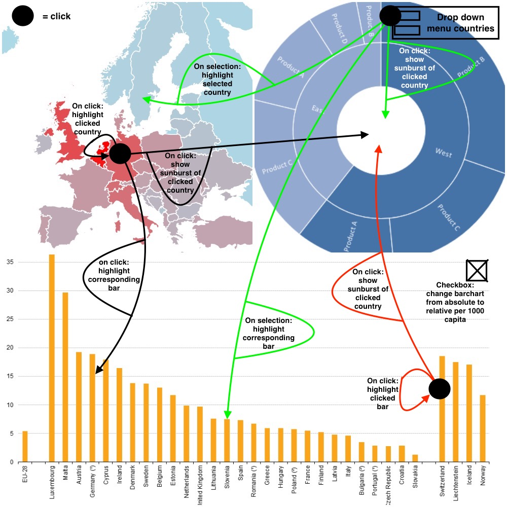

# Design Document

Course: Programmeerproject  
Name: Jasper Naberman  
Student number: 10787224  

## Data Sources
* [Dataset 1: Immigration in the EU over the years by age group, sex and citizenship - Eurostat](http://appsso.eurostat.ec.europa.eu/nui/show.do?dataset=migr_imm1ctz&lang=en)
    * This table from Eurostat can be downloaded in csv-format. This allows me to write a Python-script to convert the csv-file to a json-format with the desired layout. This dataset will be transformed in json to a dictionary.  
    With this dataset the user can view the amount of immigration per country or of all Europe over time.
* [Dataset 2: Population and other demographics of the EU countries - Eurostat](http://appsso.eurostat.ec.europa.eu/nui/show.do?dataset=migr_pop1ctz&lang=en)
   * This table from Eurostat can be downloaded in csv-format. This allows me to write a Python-script to convert the csv-file to a json-format with the desired layout. This dataset will be transformed in json to a dictionary.  
   This dataset and dataset 1 can to be combined to calculate the amount of immigrants per 1,000 citizens. This will give a more relative view of the amount of immigrants that is entering a country.
* [Dataset 3: Distribution of citizenship among immigrants, seperating nationals and non-nationals - Eurostat](http://ec.europa.eu/eurostat/statistics-explained/images/2/2f/Migration_and_migrant_population_statistics_YB2017.xlsx)
   * This dataset is an xlsx (Microsoft Excel) format. Excel allows you to store it as a csv-format, preparing it for convertion to json via a Python-script. This dataset will be transformed in json to a dictionary.  
   The dataset gives an insight in the composition of immigrant streams, separating 'nationals' and 'non-nationals' by citizenship.

## Diagram of Technical Components
This is a sketch of idea for the website; starting from a home screen the user can go to two different pages: a page with the different visualisations and interactive components, and a page with additional information such as contact info, sources, and a small story about the site and it's applications.

  
Below is a closer look at the first possible page the user can go to; the page with the different visualisations and interactive components.

## Description and Implementation
The visualizations will be implemented in different files:
* The interactive map of Europe will be created using TopoJSON. This interactive visualization will be created as a seperate function.
* The sunburst chart will be created using D3 and it's features. This visualization will be created as a seperate function.
* The interactive bar chart will be created using D3 and it's features. This interactive visualization will be created as a seperate function.  

All three of these functions will be called in a main JavaScript file. In this main file the data will be loaded, the visualization-functions will be called, and user interactivity will be implemented.  
As is seen on the above image of the visualizations-screen, the user has multiple possibilities to interact with the webpage. The implementation and interaction of these possibilities will be discussed in the list below.
* **Bar chart:** this barchart will show the absolute amount of immigrants per country that has entered in 2015. This is taken from the Eurostat dataset which will be converted to json-format. On clicking on a bar, these two things will happen:
    * The clicked bar will be highlighted
    * The data of the country that belongs to the bar will be displayed in the sunburst chart. This is done by searching the dataset used for the sunburst chart with the name of the selected country-bar.
* **Sunburst chart:**
   * Inner ring: this ring will chow the composition of immigrant streams per country or for the whole of Europe, separating 'nationals' and 'non-nationals' by citizenship. This is taken from the Eurostat dataset which will be converted to json-format.
   * Outer ring: this ring will show the relative amount of immigrants, compared to the amount of original citizens of a country (so a ratio, in percentages). This is taken from the Eurostat dataset which will be converted to json-format.
* **Europe map:** this is an interactive map of Europe, in which the color gradient will represent the absolute amount of immigrants per country that has entered in 2015. This is taken from the Eurostat dataset which will be converted to json-format. On clicking on a country, these three things will happen:
    * The clicked country will be highlighted on the map
    * The bar that corresponds with the clicked country will be highlighted in the bar chart. This is done by searching the bar chart data with the name of the clicked country.
    * The data of the clicked country will be displayed in the sunburst chart. This is done by searching the dataset used for the sunburst chart with the name of the selected country-bar.
* **Checkbox:** checking this box will change the bars from displaying absolute immigration data to relative data, by computing the amount of immigrants per 1,000 capita. This is done by taking the absolute immigration data from the barchart, and combining this data with the population dataset. This way the correct relative amount can be computed for each country.
* **Drop down menu:** this menu belongs with the sunburst chart and will let you select a European country (or the whole of Europe), to be displayed in the sunburst chart. This data is taken from the Eurostat dataset which will be converted to json-format. On selection of a country, these three things will happen:
    * The data of the selected country will be displayed in the sunburst chart.
    * The bar of the country corresponding with the selected country will be highlighted
    * The selected country will be highlighted in the TopoJSON map of Europe

#### Main functions
* drawMap() -> is called at initialization of the webpage, and selection of a bar in the barchart / country in the sunburst
* drawSunburst() -> is called at initialization of the webpage, and selection of a bar in the barchart / country on the map
* drawBarchart() -> is called at initialization of the webpage, and selection of a country on the map / country in the sunburst

#### Helper functions
* calculatePer1000Capita(totalImmigrants, totalPopulation) -> calculates the amount of immigrants per 1000 capita of the original population of a country
* calculatePercentage(totalImmigrants, totalPopulation) -> calculates the ratio (in percentages) of immigrants and the original population of a country

## APIs and D3 plugins
The elements in the following list will provide functionality for my application:
* [D3](https://d3js.org)
* [D3 Tip library](https://labratrevenge.com/d3-tip/javascripts/d3.tip.v0.6.3.js)
* [jQuery](https://jquery.com)
* [Bootstrap](https://getbootstrap.com)
* [TopoJSON](https://github.com/topojson/topojson)
* Queue