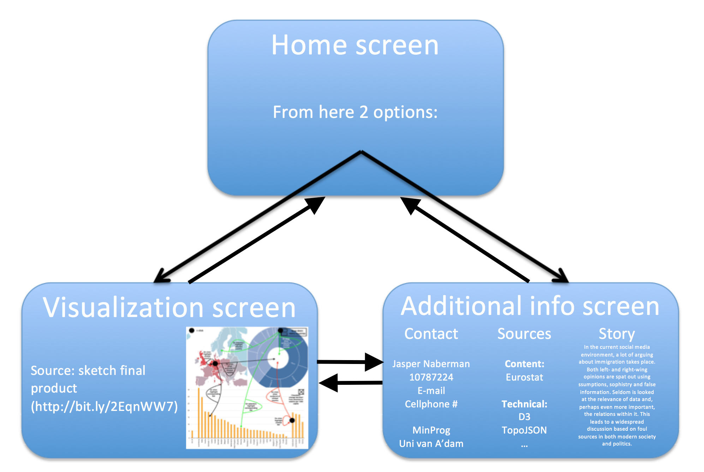

# Design Document

Course: Programmeerproject  
Name: Jasper Naberman  
Student number: 10787224  

## Data Sources
* [Dataset 1: Immigration in the EU over the years by age group, sex and citizenship - Eurostat](http://appsso.eurostat.ec.europa.eu/nui/show.do?dataset=migr_imm1ctz&lang=en)
    * This table from Eurostat can be downloaded in csv-format. This allows me to write a Python-script to convert the csv-file to a json-format with the desired layout.  
    With this dataset the user can view the amount of immigration per country or of all Europe over time.
* [Dataset 2: Population and other demographics of the EU countries - Eurostat](http://appsso.eurostat.ec.europa.eu/nui/show.do?dataset=migr_pop1ctz&lang=en)
   * This table from Eurostat can be downloaded in csv-format. This allows me to write a Python-script to convert the csv-file to a json-format with the desired layout.  
   This dataset and dataset 1 can to be combined to calculate the amount of immigrants per 1,000 citizens. This will give a more relative view of the amount of immigrants that is entering a country.
* [Dataset 3: Distribution of citizenship among immigrants, seperating nationals and non-nationals - Eurostat](http://ec.europa.eu/eurostat/statistics-explained/images/2/2f/Migration_and_migrant_population_statistics_YB2017.xlsx)
   * This dataset is an xlsx (Microsoft Excel) format. Excel allows you to store it as a csv-format, preparing it for convertion to json via a Python-script.  
   The dataset gives an insight in the composition of immigrant streams, separating 'nationals' and 'non-nationals' by citizenship.

## Diagram of Technical Components
This is a sketch of idea for the website; starting from a home screen the user can go to two different pages: a page with the different visualisations and interactive components, and a page with additional information such as contact info, sources, and a small story about the site and it's applications.

  
Below is a closer look at the first possible page the user can go to; the page with the different visualisations and interactive components.

## Description and Implementation
The visualizations will be implemented in different files. They are defined as functions. These functions will be called in a main file. In this main file the data will be loaded, vizualization functions will be imported and user interactivity will be concretized.

## APIs and D3 plugins
The elements in the following list will provide functionality for my application:
* [D3](https://d3js.org)
* [D3 Tip library](https://labratrevenge.com/d3-tip/javascripts/d3.tip.v0.6.3.js)
* [jQuery](https://jquery.com)
* [Bootstrap](https://getbootstrap.com)
* [TopoJSON](https://github.com/topojson/topojson)
* Queue
