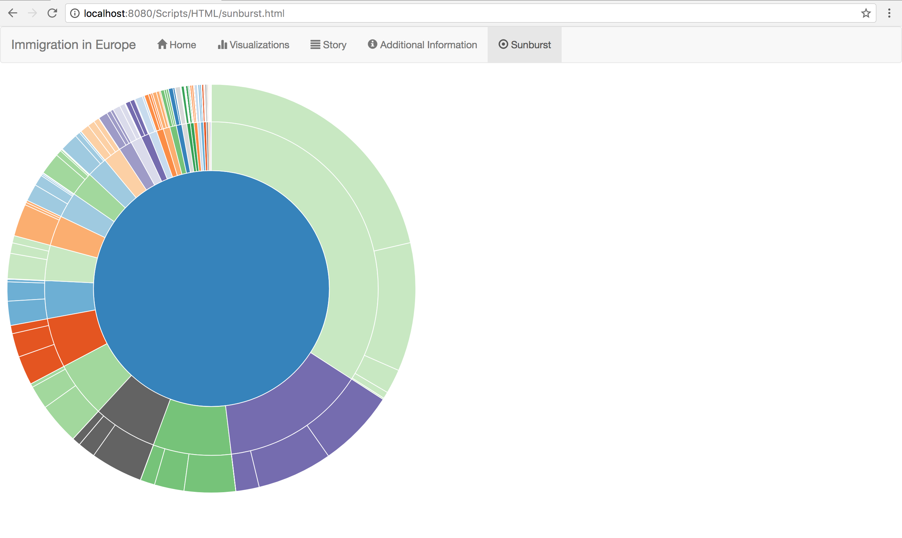

# Process Book
###### Documented development process as well as the finalized application. Contains my daily resume of design decisions and other considerations.

Course: Programmeerproject  
Name: Jasper Naberman  
Student number: 10787224  
  
# Day 1 (08-01)
Completed README.md. This document contains a project proposal.  
This proposal contains a problem statement, a solution for that problem, a visual sketch of the finalized product, a list of features available for the user (separated in features for the Minimum Viable Product and optional features), data sources, a list of external components such as libraries, a review of a similar online visualization and finally, possible bottlenecks of the project.
# Day 2 (09-01)
Started working on a design document, in the DESIGN.md file.  
This document contains a list of the data sources for the project and how they will be processed.  
It also contains a diagram of the technical components of the finalized product. This means a flowchart of the webpages, and a closer look at the visualization page of the product.  
In that last sketch it is exactly given how the different visualizations are interactive for the user and how they are linked with each other.  
Next, the design document contains a section about how the application and it’s different visualizations will be implemented, and finally, which API’s and D3 plugins it will use.
# Day 3 (10-01)
Processed the feedback on the project proposal from Day 1. This more specifically means that I changed the idea of having a line chart next to a map of Europe and a bar chart to having a sunburst chart next to these other visualizations.  
This is because I made a line chart already, during the Data Processing course. I did not make a sunburst chart yet, adding a possible extra bottleneck, but also a bit more of a challenge.  
I also thought of a way to organize my ‘to be’ json-file.
# Day 4 (11-01)
I wrote a script to convert the .csv-extension dataset to a .json-extension. The dataset consists of 6 different values per country.  
For example the data of Belgium:
    
Country | Citizen Type | Value
:---: | :---: | :---:
Belgium	| Total	| 146626
Belgium	| Reporting country | 17864
Belgium	| EU28 countries except reporting country | 6184
Belgium	| Non-EU28 countries nor reporting country | 65808
Belgium	| Stateless | 6
Belgium	| Unknown | 1108

This was organized as adding ‘Belgium’ to a dictionary, while being a dictionary itself.  
This way, the key-value pairs like ‘Total’-‘146626’ could be added to the corresponding country’s dict.  
In JSON-format, the data of Belgium looks as follows:

```
{
 "Belgium": {
  "EU28 countries except reporting country": 6184,
  "Non-EU28 countries nor reporting country": 65808,
  "Reporting country": 17864,
  "Stateless": 6,
  "Total": 146626,
  "Unknown": 1108
 }
}
```
Today I also made a skeleton/first prototype of the website. The site as it is now consists of a homepage, a visualization page, and an additional information page.  
The homepage contains some general info and a welcome message. The visualization page at the moment consists of a TopoJSON map of Europe.  
The additional information page consists of three html columns, in which a ‘Story’ about the website can be found, a list of ‘Data Sources’ and some ‘Contact’ information.

# Day 5 (12-01)
I updated the 'Additional Information page' with a small story about the problem statement and the given solution for it.  
The page now also contains some contact information and links to this GitHub repository. Finally a list of data sources is added, together with information on the used API's and D3 plugins.
On the Visualization page a new barchart is added with the absolute amount of immigrants per country.  
This barchart is already interactive, because it consists partially of a tooltip and a on mouseover function.
The JavaScript-script for this chart is located in a separate file, to keep an overview of all visualizations.
The Visualization page still holds the TopoJSON map of Europe. This map is however not yet interactive, or color coded.

# Day 6 (15-01)
I added a checkbox to the barchart to make it interactive. When the box is checked, the bars will move to be seated in a sorted fashion.  
This movement can be seen on screen for the user. Also, the names of the bars (ticklabels) move with the bars, so it is still clear to which country a bar belongs.  
I also prepared the second dataset, about the population of a certain country. In csv-format, the data for Belgium looked liked this:
  
Country | Citizen Type | Value
:---: | :---: | :---:
Belgium | Total | 11237274
  
This format was converted to json, so it later could be easier traversed in python. After the conversion, the data of Belgium looked like this:  

```
"country": "Belgium",
"value": 11237274
```
As is clear, the string "Belgium" itself isn't a dictionary anymore, as it was in the previous dataset. In this file, it is merely a key in a dict.  
I made this decision because there was just 1 value per country for this dataset, in comparison to 6 values in the previous dataset.

# Day 7 (16-01)
Today I added a lot of Bootstrap elements to the html of the site. This makes the site more visually attractive (certainly compared to the raw html style lay-out that it was before), but also adds a responsive mobility to the site, so it will look good no matter on what piece of hardware it is visited.  
To start with, I replaced the html button links to the other pages with a Bootstrap 'navbar'-navigation. This gives a clear overview of the pages of the site, and notifies the user what page (s)he currently looked at, by highlighting the correct tab in the bar.  
Next, I placed all the headers of the different pages in containers, so they will be resized as the browser resizes.
All the pages are given a title in the html header, that will be displayed in the browser's tab of the site.
The 'Additional Information' page, which previously existed of three html columns, now holds three Bootstrap 'wells'. All with separate headers and highlightings.
The homepage, which held a small welcome message, now consists of a picture of an immigrant family, as background of the title of the website in big white letters. It also holds a footer, with two columns, with some very general information, like my name, and the course of this assignment. The picture below is a screenshot of the homepage. The footer is not visible in the picture, since it is only visible after scrolling down.  
.png)  

# Day 8 (17-01)
I replaced the footer of the bottom of the homepage html with a bootstrap jumbotron, for aesthetic purposes. Some of the text in the jumbotron are links. I spend a lot of time trying to figure out which kind of map-visualization to use: DataMaps or TopoJSON. Most people (on the internet and TA's) recommended DataMaps, so that's what I went with. I downloaded a custom json file from TopoJSON, since DataMaps doesn't provide a default map for Europe only. The file is loaded in and appended to a <div> tag in the html. The 'Visualizations'-page now holds an interactive map, that shows a country's name and highlights the country. It has yet to be color coded. The map now stands on top of the page, with the barchart below it.  
I added a target to all the html links, so that they open in a new browser tab, instead of leaving the application website.  
I added an extra html page containing the story of the site, which was previously on the additional information page. This new page consists of two jumbotrons with a picture.  
Finally I added glyphicons for all the pages in the navigation bar, so it is more visually intuitive what kind of page it is. A screenshot of the new Story-page is added below. In this picture the glyphicons are also visible.  
.png)  
  
# Day 9 (18-01)
Because of the storm in The Netherlands that ripped the roof of the university building, I wasn't able to do significant amounts of work.  
  
# Day 10 (19-01)
Today I worked on the population dataset. At this moment I have organized it as a dict, where the country is the key, and the amount of people living in the country is the value.  
I also replaced the checkbox for sorting the barchart to 2 radio buttons, since it is sorted alphabetically or reverse sorted numerical.  
Finally I replaced the picture of the homepage and the pictures on the storypage with other pictures, because of possible copyright issues.  
  
# Day 11 (22-01)  
Today I changed the TopoJSON structure from having 2 letter country codes to three letter country codes, to make it compatible with Datamaps-commands. I also created an new data file for the map, which contains a country's name, country code, population size and immigration stream. The JSON of this file for one country looks as follows:  
  
```
{
 "Austria": {
  "population": 8576261,
  "immigrants": 166323,
  "code": "AUT"
 }
}
```  
With this I could compute how many immigrants came into a country per 1000 original citizens. I did this by computing a quotient: the country's population divided by a thousand. Then I divided the amount of immigrants by the quotient to come up with the amount of immigrants per 1000 capita.  
With this information per country, I color coded the Datamaps map of Europe. A darker shade meaning a higher amount of immigrants per 1000 capita. Since Luxembourg was an outlier in the data that resulted in not seeing differences between other countries very well, I used a logarithmic function instead of a linear one for the color coding.  
  
# Day 12 (23-01)  
Today I completed the sunburst chart. At the moment it contains all the countries in the inner ring, and for every country the composition of the immigration stream. The sunburst is zoomable, so you can click on a country to take a closer look at it. At the moment the chart is at a different html page than the other visualizations, because the script gets confused with variable names and svg appends. A screenshot of the sunburst is found below.  
  
  
# Day 13 (24-01)  
Today I relocated the sunburst chart to the main visualizations-page. It now stands right to the map, above the bar chart. The color scheme of the sunburst consists of the same range as the colors of the map. I also added a map legend, consisting of a color gradient and some text.  For the bar chart I changed the checkbox to sort the bars to two radio buttons, so the user is clearly informed what kind of sortation (s)he is looking at. Finally, I added a tooltip to the sunburst. This works also while zoomed in. A screenshot of the visualization page is found below.  
.png) 
  
# Day 14 (25-01)
Today I added more interactivity for the user by linking the three visualizations with each other. Now, when the user clicks on a bar, the sunburst zooms in on the country of that bar. The same holds for the map; when the user clicks on a country, the sunburst is updated for that country. I also added a drop down menu where the user can select a country. At the moment that fails to deliver any form of action, but eventually it will hopefully update the sunburst as well.  
  
